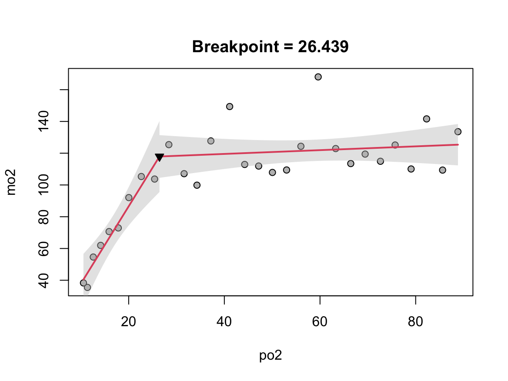

# respirometry: Tools for Conducting Respirometry Experiments

##### This R package provides tools to enable the researcher to more precisely conduct respirometry experiments. Strong emphasis is on aquatic respirometry. Tools focus on helping the researcher setup and conduct experiments. Functions for analysis of resulting respirometry data are also provided. This package provides tools for intermittent, flow-through, and closed respirometry techniques.

------------------------------------------------------------------------

# How to cite

If this package is useful to you in your research, please cite as Birk M.A. (2016) respirometry: Tools for Conducting Respirometry Experiments. <http://cran.r-project.org/package=respirometry>.

------------------------------------------------------------------------

# Supported oxygen meters

#### PyroScience (<https://www.pyroscience.com/>)

-   Any meter running off of Pyroscience Workbench software
-   Any meter running off of Pyro Oxygen Logger software (deprecated)

#### PreSens (<https://www.presens.de/>)

-   Fibox 4
-   Fibox 3
-   Fibox 3 trace
-   Fibox 3 LCD trace
-   Microx TX3
-   Microx TX3 trace
-   SDR SensorDish Reader

#### Loligo Systems (<http://loligosystems.com/>)

-   Witrox

If you have another device that is not supported, feel free to reach out and send me a data file and let me know from what device and software it was generated. I'm happy to consider incorporating support for your meter into future versions.

------------------------------------------------------------------------

# Tools for preparing respirometry experiments

Before designing any experiments, it would be useful to know some important things. For example, below are a list of common questions and some examples of functions you can use to answer them.

-   The literature has MO<sub>2</sub> or P<sub>crit</sub> measurements at some temperatures other than the temperature at which I want to measure. How different will things be?: `adj_by_temp()`, `Q10()`.

-   The literature has MO<sub>2</sub> measurements at some animal size other than the sizes at which I want to measure. How different will things be?: `scale_MO2()`.

-   How fast of a flowrate do I need to maintain a given PO<sub>2</sub>?: `min_flow()`.

-   How high of a metabolic rate can be supported by a given flowrate?: `max_MO2()`.

-   How big of a respirometer should I build for my P<sub>crit</sub> experiment?: `closed()`.

-   How long will it take for PO<sub>2</sub> to decline by X during the trial?: `closed()`.

-   How much will PO<sub>2</sub> decline each hour?: `closed()`.

-   How fast should I expect metabolism to be at a new temperature I've never measured before?: `Q10()`

-   How high will ammonia levels get?: `predict_nh3()`, `conv_nh4()`.

-   How low will pH get?: `predict_pH()`.

-   Other researchers' favorite O<sub>2</sub> or MO<sub>2</sub> metric is different than mine. Convert between common metrics (e.g. kPa O<sub>2</sub> -\> mg O<sub>2</sub>, ml O<sub>2</sub>/kg/min -\> $\mu$mol O<sub>2</sub>/g/h): `conv_o2()`, `conv_resp_unit()`.

-   How much will I need to flush my respirometer to get a desired percent exchange with new water?: `flush_water()`.

------------------------------------------------------------------------

# Tools for running respirometry experiments

I've developed a few tools I've found useful to use while respirometry experiments are running. These help you make more informed decisions and thus (hopefully) produce better data. Note that the tools for analyzing experiments (below) can also be used during the experiment as long as you have access to up-to date versions of the raw files from the O<sub>2</sub> meter(s). For example, I track the progress of my P<sub>crit</sub> trials live so that I can see when P<sub>crit</sub> has or has not yet been reached.

-   How much longer will it be until my closed respirometer (e.g. P<sub>crit</sub>) experiment reaches a PO<sub>2</sub> of X?: `guess_when()`.
-   Oh bummer, a bubble leaked into the respirometer. How much is it throwing things off? Should I risk removing it?: `correct_bubble()`.
-   During intermittent respirometry, how long or how quickly should I flush my respirometer to get the O<sub>2</sub> level to my desired endpoint after the flush?: `flush_o2()`.
-   How long should I run a peristaltic pump to get X moles of a gas into my respirometer / seawater?: `peri_pump()`.

#### Tools specifically useful for running ocean acidification experiments

-   How much CO<sub>2</sub> do I need to add to get the desired PCO<sub>2</sub>?: `co2_add()`, `co2_flush()`, `co2_rate()`.
-   During intermittent respirometry, how will carbonate chemistry change in the respirometer after this upcoming flush?: `flush_carb()`, `goal_flush_pH()`.
-   What's a rough guess of the total alkalinity of my seawater?: `guess_TA()`.

------------------------------------------------------------------------

# Tools for analyzing respirometry experiments

Of course, any respirometry experiment will need to be analyzed. Depending on the kind of experiment and analysis you need to do, a variety of tools are available:

-   Calculate metabolic rate from trial data: `calc_MO2()`, `make_bins()`.
-   Calculate P<sub>crit</sub> from trial data: `calc_pcrit()`, `plot_pcrit()`.
-   Calculate the metabolic scaling coefficient (b) across a range of organismal sizes: `calc_b()`.
-   Calculate the temperature-dependence of a biological process (e.g. MO<sub>2</sub>, P<sub>crit</sub>): `Q10()`, `calc_E()`.
-   Calculate the oxygen supply capacity ($\alpha$): `calc_alpha()`.
-   If MO<sub>2</sub> was measured at a variety of temperatures, interpolate to novel temperatures between measured temperatures: `adj_by_temp()`.
-   Adjust measured metabolic rates based on variation in animal size (i.e. mass-correct your MO<sub>2</sub> data): `scale_MO2()`.
-   Calculate the animal's respiratory quotient: `RQ()`.

------------------------------------------------------------------------

# General analysis outline (for R beginners)

If you're new to R, welcome to this powerful new world; but you've probably already seen or heard, it has a steep learning curve! If you're new to R and want to use this package, a few common issues I see are: - Even after you've installed this package in R, you'll need to "load" it everytime you start a new R session. You do this by running:

```         
library(respirometry)
```

This will then give you access to all the tools available here. To learn more about a tool and how to use it, enter a question mark followed by the name of the function. For example, to learn how to import data from the Pyroscience Workbench app, you can run:

```         
?import_pyroscience_workbench
```

This will show you all the details for importing data.

One common thing people want to do is to calculate P<sub>crit</sub> from a trial. A very simple bare-bones script of code for doing this would be:

```         
raw_data <- "the/path/to/the/folder/where/my/data/are/stored/"
o2_data <- import_pyroscience_workbench(folder = raw_data)
mo2_data <- calc_MO2(duration = o2_data$DURATION, o2 = o2_data$CH_1_O2, bin_width = 10, vol = 3)
plot_pcrit(mo2_data = mo2_data)
```

 Here, we imported data from Pyroscience Workbench, calculated metabolic rate in Channel 1 by making 10 minute bins and inputting a 3 liter volume, and finally plotted P<sub>crit</sub> using the traditional breakpoint method. The plot shows a P<sub>crit</sub> of 26 % air saturation.
